# CMPS14-ESP32-SignalK Gateway

[](https://www.espressif.com/en/sdks/esp-arduino)
[](https://www.robot-electronics.co.uk/files/cmps14.pdf)
[](https://signalk.org)
[](LICENSE)

ESP32-based reader for Robot Electronics [CMPS14](https://www.robot-electronics.co.uk/files/cmps14.pdf) compass & attitude sensor. Sends heading, pitch and roll to [SignalK](https://signalk.org) server via websocket/json and to other ESP32 devices via ESP-NOW.

Applies installation offset, deviation and magnetic variation to raw angle to determine compass heading, magnetic heading and optionally true heading. Computes deviation at any compass heading, based on user-measured deviations at 8 cardinal and intercardinal directions. Subscribes magnetic variation from SignalK server. This is prioritized over manually entered variation to determine true heading.

Uses LCD 16x2 to show status messages and heading. If no wifi around, runs on LCD only.

Runs a webserver to provide web UI for CMPS14 configuration. Configurable parameters: calibration mode (full auto, auto, manual), installation offset, measured deviations, manual variation, heading mode (true, magnetic) and attitude leveling. Web UI protected with session-based authentication.

OTA updates and persistent storage of configuration and web UI password in ESP32 NVS are enabled.

Led indicators for calibration mode and connection status (two leds).

Developed and tested on:
- [SH-ESP32](https://docs.hatlabs.fi/sh-esp32/) development board (2.2.1)
- [ESP32 board package](https://github.com/espressif/arduino-esp32) (3.3.5)
- [Arduino IDE](https://www.arduino.cc/en/software/) (2.3.6)
- SignalK Server (2.18.0)
- CMPS14 sensor (V7)

## Purpose of the project

This is one of my individual digital boat projects. Use at your own risk. Not for safety-critical navigation.

1. I needed a reliable low-cost digital compass that could be connected to SignalK server of my vessel
2. I wanted to learn ESP32 capabilities for other digital boat projects that are on my backlog
3. I felt I had to refresh my C/C++ skills as I had not delivered any code since 2005 (and before that mostly Java and Smallworld Magik)

I started the project Arduino-style by copying code from a previous project (VEDirect-ESP32-SignalK-gateway). Then, I just kept playing around with Arduino. The next project will be most likely based on SensESP/PlatformIO to keep things less complicated.

## Release history

| Release | Branch                  | Comment                                                                    |
|---------|-------------------------|----------------------------------------------------------------------------|
| v1.2.0  | main                    | Latest release. Added ESP-NOW broadcast. See CHANGELOG for details.        |
| v1.1.0  | main                    | Added web authentication. See CHANGELOG for details.                       |
| v1.0.1  | main                    | See CHANGELOG for details.                                                 |
| v1.0.0  | main                    | Refactored into classes with new features not implemented in v0.5.x.       |
| v0.5.1  | legacy/procedural-0.5.x | Last fully procedural version.                                             |

## Classes

### Class CMPS14Sensor

The heart of the project is the modest library-like class `CMPS14Sensor` which communicates with the CMPS14 device. It has the following public API:

| Method | Returns | Comment |
|--------|----------------|--------|
| `begin(TwoWire &wirePort)` | `bool` | Initialize sensor |
| `available()` | `bool` | Check the availablility of the sensor |
| `read(float &angle_deg, float &pitch_deg, float &roll_deg)` | `bool` | Read sensor raw values (degrees) to the float variables |
| `sendCommand(uint8_t cmd)` | `bool` | Send any command to the sensor |
| `readRegister(uint8_t reg)` | `uint8_t` | Read any register of the sensor |
| `isAck(uint8_t byte)` | `bool` | Return true if byte is ACK |
| `isNack(uint8_t byte)` | `bool` | Return true if byte is NACK |

The simple usage of CMPS14Sensor could be:

```
#include <Arduino.h>
#include <Wire.h>
#include "CMPS14Sensor.h"

CMPS14Sensor sensor(0x60); // I2C address

void setup() {
   Serial.begin(115200);
   Wire.begin(16, 17); // SDA, SCL
   delay(100);
   sensor.begin(Wire);
}

void loop() {
   const unsigned long now = millis();
   static unsigned long last = 0;
   if ((long)(now - last) < 1000) return; // Read at 1 Hz
   float angle_deg = 0.0f, pitch_deg = 0.0f, roll_deg = 0.0f;
   if (sensor.available() && sensor.read(angle_deg, pitch_deg, roll_deg)) {
      Serial.println(angle_deg);
      Serial.println(pitch_deg);
      Serial.println(roll_deg);
   }
}

```
### Other classes

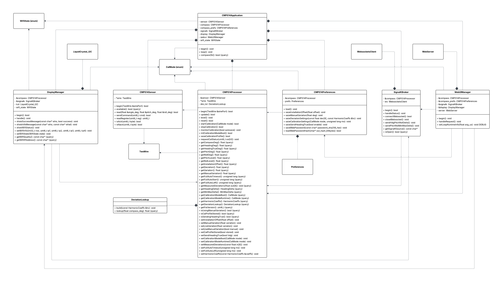

Each class presented in the diagram with their full public API. Private attributes only to demonstrate class relationships.

**`CMPS14Processor`:** 
- Owns: `DeviationLookup`
- Uses: `CMPS14Sensor`, `CalMode` and `TwoWire`
- Owned by: `CMPS14Application`
- Responsible for: the main business logic, acts as "the compass"

**`CMPS14Preferences`:** 
- Owns: `Preferences`
- Uses: `CMPS14Processor` and `CalMode`
- Owned by: `CMPS14Application`
- Responsible for: loading and saving data to ESP32 NVS

**`SignalKBroker`:** 
- Owns: `WebsocketsClient`
- Uses: `CMPS14Processor`
- Owned by: `CMPS14Application`
- Responsible for: communication with SignalK server

**`ESPNowBroker`:** 
- Uses: `CMPS14Processor`
- Owned by: `CMPS14Application`
- Responsible for: communication via ESP-NOW protocol

**`DisplayManager`:**
- Owns: `LiquidCrystal_I2C`
- Uses: `CMPS14Processor`, `SignalKBroker`, `WifiState` and `CalMode`
- Owned by: `CMPS14Application`
- Responsible for: LCD display and LEDs, acts as "the display"

**`WebUIManager`:**
- Owns: `WebServer`
- Uses: `CMPS14Processor`, `CMPS14Preferences`, `SignalKBroker`, `DisplayManager` and `CalMode`
- Owned by: `CMPS14Application`
- Responsible for: providing web user interface, acts as "the webui"

**`CMPS14Application`:**
- Owns: `CMPS14Sensor`, `CMPS14Processor`, `CMPS14Preferences`, `SignalKBroker`, `ESPNowBroker`, `DisplayManager` and `WebUIManager`
- Uses: `WifiState` and `CalMode`
- Responsible for: orchestrating everything within the main program, acts as "the app"

**`DeviationLookup`:**
- Owned by: `CMPS14Processor`
- Responsible for: deviation lookup table

**`CalMode`:**
- Global enum class for different calibration modes of CMPS14

**`WifiState`:**
- Global enum class for different WifiStates maintained and shared by `CMPS14Application` 

## Features

### Compass and attitude

1. Reads angle, pitch and roll from CMPS14 at ~20 Hz frequency
2. Applies installation offset (user input) to raw angle for compass heading
3. Applies smoothing to compass heading
4. Applies deviation on compass heading for magnetic heading
5. Computes true heading (optional), using either
   - Live *navigation.magneticVariation* received from SignalK (prioritized over user input)
   - Manual variation from user input on web UI (used automatically whenever *navigation.magneticVariation* is not available)
6. Applies leveling to pitch and roll
7. Installation offset and selected heading mode are stored persistently in ESP32 NVS, leveling of pitch and roll is not

### Deviation

1. Takes 8 user-measured deviations (N, NE, E, SE, S, SW, W, NW) as input from web UI
2. Computes 5 harmonic coefficients (A, B, C, D, E) that best fit the mathematical model `deviation(θ) = A + B·sin(θ) + C·cos(θ) + D·sin(2θ) + E·cos(2θ)` using least squares regression and Gauss-Jordan elimination, providing smooth sinusoidal curve through all 8 user-measured points
3. User-measured deviations and computed 5 coeffs are stored persistently in ESP32 NVS
4. A deviation lookup table is computed each time the 5 coeffs change and on ESP32 boot. The lookup table contains the deviation for each 1° over 360°. The lookup method will apply a linear interpolation for better accuracy when retrieving a value from the lookup table at a compass heading.
5. Deviation curve and deviation table at simplified 10° resolution available on web UI

**Note that deviation can be applied only to a permanently mounted stable compass. While CMPS14 can be securely mounted to the vessel, it's behavior may still be altered by calibration (automatic or manual). It is recommended to keep deviation at 0° until there are undeniable evidence that the compass is stable and operating without any needs for regular calibration. It's obvious that the deviations should always be re-measured and computed after each calibration.**

### Magnetic variation

1. Subscribes *navigation.magneticVariation* path from SignalK server at ~1 Hz cycles. This is treated as primary and the most trusted source of magnetic variation.
2. User may enter magnetic variation manually on the web UI. This is a backup and the value will be used automatically if variation is not available at SignalK path.
3. User-defined manual variation is persistently stored in ESP32 NVS.
4. Magnetic variation is used for computing true heading on magnetic heading.

**Note that when the SignalK connection is open, the magnetic heading will always be sent to SignalK *navigation.headingMagnetic* path regardless of the active heading mode (true/magnetic). It is a standard practise to compute true heading on server side using SignalK [Derived Data](https://github.com/SignalK/signalk-derived-data) plugin or similar, or on other clients such as [OpenCPN](https://opencpn.org) that utilize [WMM](https://www.ncei.noaa.gov/products/world-magnetic-model).**

### SignalK communication

Connects to:
```
ws://<server>:<port>/signalk/v1/stream?token=<optional>
```

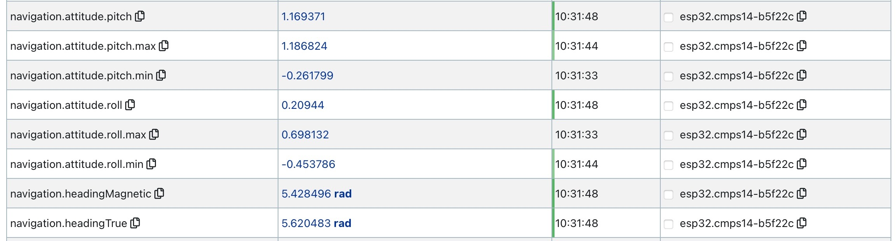

**Sends** at maximum ~10 Hz frequency, in radians, with a deadband of 0.25°:

1. *navigation.headingMagnetic*
2. *navigation.attitude.pitch*
3. *navigation.attitude.roll*
4. (optionally) *navigation.headingTrue*

**Sends** at maximum ~1 Hz frequency, in radians, only if changed:

1. *navigation.attitude.pitch.max*
2. *navigation.attitude.pitch.min*
3. *navigation.attitude.roll.max*
4. *navigation.attitude.roll.min*

The min and max values reset to zero on ESP32 restart and after applying attitude leveling. They are *not* persistently stored in ESP32 NVS.

**Receives** at ~1 Hz frequency, in radians:

1. *navigation.magneticVariation* (if available at SignalK)

**Please refer to Security section of this file.**

### ESP-NOW broadcast

Broadcasts compass data via ESP-NOW protocol for other ESP32 devices, such as external displays (e.g., Crow Panel 2.1" HMI).

**Sends** at ~10 Hz frequency, in radians, with a deadband of 0.25° (struct content equal to the struct in SignalK sending):
- `HeadingDelta` struct containing:
  - `heading_rad` (magnetic heading)
  - `heading_true_rad` (true heading)
  - `pitch_rad`
  - `roll_rad`

**Broadcast mode:** Uses broadcast address (FF:FF:FF:FF:FF:FF) - any ESP-NOW receiver on the same WiFi channel can listen.

**WiFi coexistence:** ESP-NOW operates alongside WiFi (AP_STA mode). Both SignalK WebSocket and ESP-NOW broadcast function simultaneously.

**Note: ESP-NOW receivers must be on the same WiFi channel as the compass. Simplest approach is to connect both devices to the same WiFi network.**


### Calibration modes

Three supported calibration modes and use-mode for normal operation:

1. *FULL AUTO* - CMPS14's built-in autocalibration & autosave + optional user configurable stop timer
2. *AUTO* - auto-detect good enough calibration to save automatically
3. *MANUAL* - user-triggered calibration with manual save/replace
4. In *USE* mode the CMPS14 operates normally based on saved calibration profile (no calibration is running).

When calibration is running, *SYS*, *ACC* and *MAG* indicators are monitored at ~2 Hz frequency.

*FULL AUTO* and *AUTO* will activate on ESP32 boot. The *FULL AUTO* will run until the user configured stop timer or eternally if the timer is set to 0. The *AUTO* will run until all three indicators equal 3 (the best) over three consecutive cycles, then the calibration profile will be saved and *USE* mode will be activated. When *USE/MANUAL* is selected, no calibration will be started on ESP32 boot. Instead, the device will start directly to *USE* mode. In *MANUAL* mode (press *CALIBRATE*) user may decide when to save by monitoring the values on web UI status block.

The calibration mode selection (including optional *FULL AUTO* timeout) is stored persistently in ESP32 NVS.

The calibration profile is saved on CMPS14 internally, *not* in ESP32 NVS.

**Note that CMPS14's *GYR* indicator for gyro is not monitored. There is a reported firmware bug in CMPS14 that makes *GYR* indicator unreliable.**

### Web UI (WebServer)

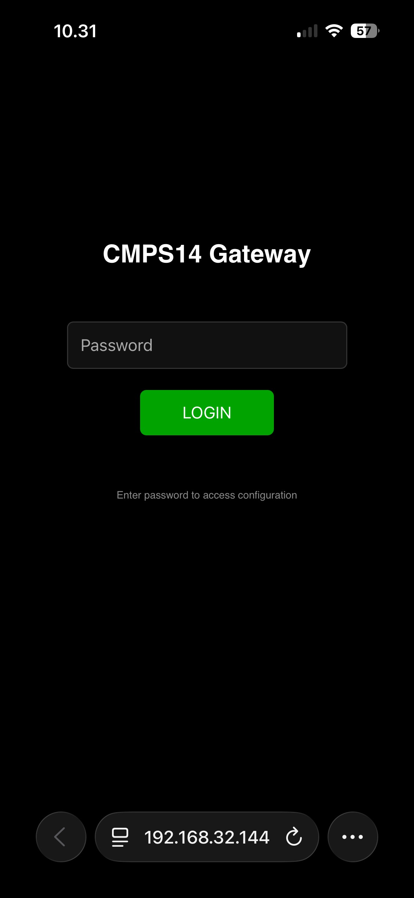 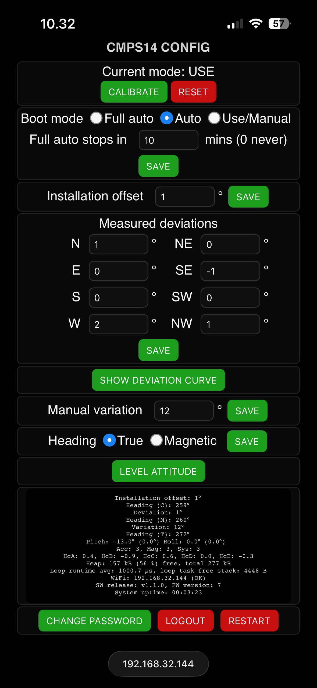 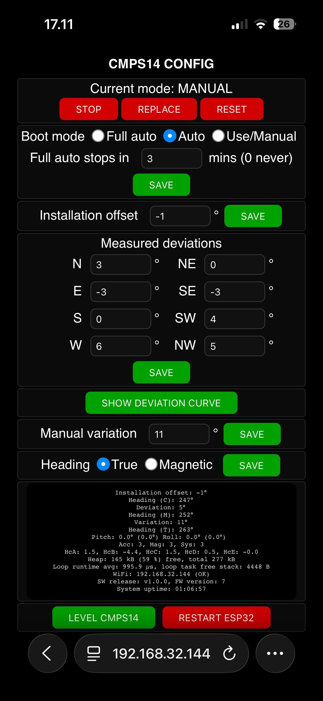 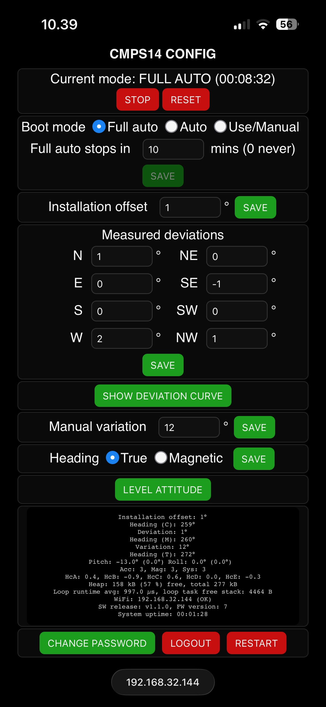  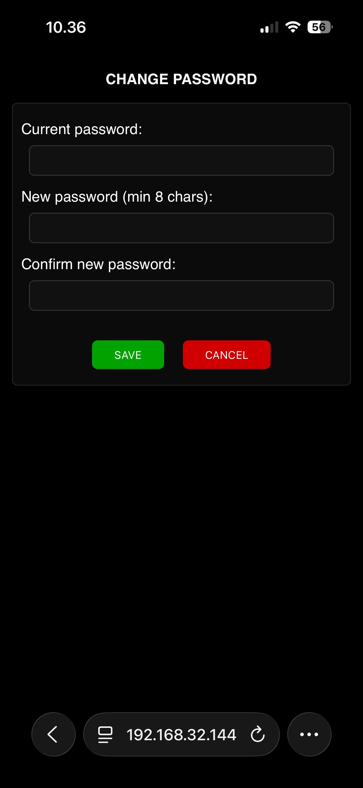 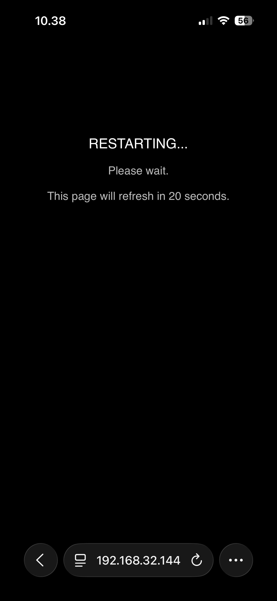

Webserver provides simple responsive HTML/JS user interface for user to configure:

1. Calibration mode on boot and optional *FULL AUTO* timeout (mins)
   - 0 mins timeout never turns *FULL AUTO* mode off automatically
   - Effective after ESP32 boot
3. Installation offset (degrees)
   - Positive offset corrects the heading *towards* starboard, meaning that the compass mounting is tilted port side
   - Negative offset corrects the heading *towards* port side, meaning that the compass mounting is tilted starboard
   - Effective immediately
4. Measured deviations at 8 cardinal and intercardinal directions (degrees)
   - Assumes the user has measured deviations with the standard maritime navigation routine:
     ```
     HDG(C) -> Dev -> HDG(M) -> Var -> HDG(T)
     ```
   - Effective immediately
5. Manual magnetic variation (degrees)
   - Positive value is E, negative value is W
   - Effective immediately, however SignalK *navigation.magneticVariation* will be used instead whenever available
6. Heading mode (true/magnetic)
   - True is the default
   - Magnetic heading will always be sent to SignalK *navigation.headingMagnetic* path, also when True is selected
   - Effective immediately
  
All above are stored persistently in ESP32 NVS and will be automatically retrieved on ESP32 boot.

Additionally the user may:

1. Start the calibration by pressing *CALIBRATE* in *MANUAL* mode
2. *STOP* the calibration in all calibration modes without saving calibration profile
3. *SAVE* the calibration profile in *AUTO* and *MANUAL* calibration modes
   - If calibration profile has already been saved since ESP32 boot, the *REPLACE* button is shown instead of *SAVE*
4. *RESET* CMPS14 to factory settings
   - There is a 600 ms delay after reset in the background, doubling the delay from data sheet recommendation
   - Reset does *not* reset configuration settings stored in NVS nor pitch/roll min/max values
5. *SHOW DEVIATION CURVE*
   - Opens a new page with a back-button pointing to the configuration page
   - Simplified deviation curve and deviation table presented 0...360° with 010° resolution
6. *LEVEL ATTITUDE* to zero
   - Takes the negation of the latest pitch and roll to capture the leveling factors for attitude
   - Leveling factors are applied to the raw pitch and roll
   - Thus, user may reset the attitude to zero at any vessel position to start using proportional pitch and roll
   - Leveling is not incremental and the leveling factors are *not* stored persistently in ESP32 NVS
   - Leveling resets pitch/roll min/max values
8. *RESTART* the system
   - Opens a temporary page which will refresh back to the configuration page after 20 seconds
   - In the background, the restart will be executed ~5 seconds after pushing the button
   - Calls `ESP.restart()` of `esp_system`
9. View the parameters on status block
   - JS generated block that updates at ~1 Hz cycles
   - Shows: installation offset, compass heading, deviation on compass heading, magnetic heading, effective magnetic variation, true heading, pitch (leveling factor), roll (leveling factor), 3 calibration status indicators, 5 coeffs of harmonic model, debug heap memory status, debug loop task average runtime and free loop task stack memory, IP address and wifi signal level description, software version, CMPS14 firmware version, system uptime
10. *CHANGE PASSWORD* for web UI authentication
    - Opens a page for user to change the web UI password
    - Minimum 8 characters
11. *LOGOUT* from web UI
    - Clears session

### Web UI authentication

The web UI is protected by session-based authentication.

**Default password:** defined in `secrets.h`.

**First login:**
1. On first boot, LCD displays "DEFAULT PASSWORD! CHANGE NOW!"
2. Navigate to `http://<esp32ipaddress>/`
3. Enter default password
4. Change password immediately after first login via *CHANGE PASSWORD* button

**Password:**
- Minimum 8 characters
- Stored as SHA256 hash in NVS
- Persistent, survives ESP32 reboots

**Session Management:**
- Sessions valid for 6 hours
- Automatic timeout on inactivity
- Up to 3 concurrent users
- Logout button available on all pages

### Webserver endpoints

| Path | Method | Auth | Description | Parameters |
|------|--------|------|-------------|------------|
| `/` | GET | No | Login page or redirect to `/config` | none |
| `/login` | POST | No | Login handler | `password=<password>`  |
| `/logout` | POST | No | Logout and clear session | none |
| `/changepassword` | GET | Yes | Password change form | none |
| `/changepassword` | POST | Yes | Password change handler | `old=<old_pw>&new=<new_pw>&confirm=<confirm_pw>`  |
| `/config` | GET | Yes | Main UI | none |
| `/cal/on` | POST | Yes | Start calibration | none |
| `/cal/off` | POST | Yes | Stop calibration | none |
| `/store/on` | POST | Yes | Save calibration profile | none |
| `/reset/on` | POST | Yes | Reset CMPS14 | none |
| `/calmode/set` | POST | Yes | Save calibration mode | `?c=<0\|1\|2\|3>&t=<0...60>` // 0 = FULL AUTO, 1 = AUTO, 2 = MANUAL, 3 = USE |
| `/offset/set` | POST | Yes | Installation offset | `?v=<-180...180>` // Degrees (-) correct towards port side, (+) correct towards starboard  |
| `/dev8/set` | POST | Yes | Eight deviation points | `?N=<n>&NE=<n>&E=<n>&SE=<n>&S=<n>&SW=<n>&W=<n>&NW=<n>` // <n> = deviation in degrees |
| `/deviationdetails` | GET | Yes | Deviation curve and table | none |
| `/magvar/set` | POST | Yes | Manual variation | `?v=<-90...90>` // Degrees (-) west, (+) east |
| `/heading/mode` | POST | Yes | Heading mode | `?m=<1\|0>` // 1 = HDG(T), 0 = HDG(M)  |
| `/status` | GET | Yes | Status block | none |
| `/restart` | POST | Yes | Restart ESP32 | `?ms=5003` // Delay before actual restart in ms |
| `/level` | POST | Yes | Level CMPS14 attitude | none |

Endpoints can be used by external HTTP clients. Note that state-changing endpoints require POST method, parameters within POST body. For example, to add leveling of attitude to a [KIP](https://github.com/mxtommy/Kip) dashboard, you would create a button that sends a POST request to `http://<esp32ipaddress>/level`.

**Please refer to Security section of this file.**

### LCD 16x2

1. Shows heading (true or magnetic, depending on user preference on web UI)
2. Shows info messages on the way, related to calibration status, user interaction on web UI, OTA update progress etc.
3. LCD shows messages from a message queue on fifo basis, every 1.5 seconds
4. To avoid unnecessary blinking the LCD will refresh only if the content to be shown is different from what's already on the display.

Using different display can be done within `DisplayManager` class while ensuring its public API stays intact for backwards compatibility.

### Two led indicators

1. GPIO2 blue led indicator (built in led on my SH-ESP32 board)
   - Fast ~5 Hz blinking: wifi not connected
   - Medium ~2 Hz blinking: wifi connecting
   - Slow ~1 Hz blinking: wifi connected
   - Solid state: websocket connected to SignalK server
   - Off: I have a bad feeling about this.  
1. GPIO13 green led indicator (additional led soldered onto the board)   
   - Solid state: *USE* mode
   - Fast ~5 Hz blinking: *AUTO* or *MANUAL* calibration mode active
   - Slow ~0.5 Hz blinking: *FULL AUTO* calibration mode active
   - Off: Houston, we have a problem.
  
## Project structure

| File(s) | Description |
|----------|-------------|
| `CMPS14-ESP32-SignalK-gateway.ino` | Owns CMPS14Application app, contains setup() and loop() |
| `secrets.example.h`| Example credentials. Rename to `secrets.h` and populate with your credentials. |
| `version.h` | Software version |
| `CalMode.h` | Enum class for CMPS14 calibration modes |
| `WifiState.h` | Enum class for wifi states |
| `harmonic.h/harmonic.cpp` | Struct and functions to compute deviations, class DeviationLookup |
| `CMPS14Sensor.h/CMPS14Sensor.cpp` | Class CMPS14Sensor, the "sensor" |
| `CMPS14Processor.h/CMPS14Processor.cpp` | Class CMPS14Processor, the "compass" |
| `CMPS14Preferences.h/CMPS14Preferences.cpp` | Class CMPS14Preferences, the "compass_prefs" |
| `SignalKBroker.h/SignalKBroker.cpp` | Class SignalKBroker, the "signalk" |
| `ESPNowBroker.h/ESPNowBroker.cpp` | Class ESPNowBroker, the "espnow" |
| `DisplayManager.h/DisplayManager.cpp` | Class DisplayManager, the "display" |
| `WebUIManager.h/WebUIManager.cpp` | Class WebUIManager, the "webui" |
| `CMPS14Application.h/CMPS14Application.cpp` | Class CMPS14Application, the "app" |

## Hardware

### Schematic


### Bill of materials

1. ESP32 module (developed and tested with SH-ESP32 board)
2. CMPS14 sensor (I2C mode) connected with 1.2 m CAT5E network cable
3. LCD 16x2 module(with I2C backpack) connected with 1.2 m CAT5E network cable
4. LEDs
   - blue led at GPIO2 (built-in led on SH-ESP32 board)
   - green led at GPIO13 in series with 330 ohm resistor
5. Sparkfun bi-directional [logic level converter](https://www.sparkfun.com/sparkfun-logic-level-converter-bi-directional.html)
   - SH-ESP32 runs 3.3 V internally
   - CMPS14 accepts both 3.3 V and 5 V
   - LCD accepts both 3.3 V and 5 V but is sharper with 5 V
   - Soldered logic level converter onto the board and used 5 V both for CMPS14 and LCD (I2C comms)
6. Joy-IT step-down [voltage converter](https://joy-it.net/en/products/SBC-Buck04-5V)
   - SH-ESP32 accepts 8 - 32 V, this is step-down to 5 V for CMPS14 and LCD
7. IP67 enclosures for CMPS14 and SH-ESP32, cable glands and SP13 connectors
8. Jumper wires, male row headers (2.54 mm)
9. 3D printed [panel mount bezel](https://www.printables.com/model/158413-panel-mount-16x2-lcd-bezel) for LCD 16x2 (temporarily a black 2 x 4 x 1 inch plastic box with a cut hole)
10. Wifi router providing wireless LAN AP
11. MacOS laptop in LAN running SignalK server

**No paid partnerships.**

## Software used

1. Arduino IDE 2.3.6
2. Espressif Systems esp32 board package 3.3.5
3. Additional libraries installed:
   - ArduinoWebsockets (by Gil Maimon version 0.5.4)
   - ArduinoJson(by Benoit Blanchon version 7.4.2)
   - ArduinoOTA (by Arduino, Juraj Andrassy version 1.1.0)
   - LiquidCrystal_I2C (by Frank de Brabander version 1.1.2)

## Installation

1. Clone the repo
   ```
   git clone https://github.com/mkvesala/CMPS14-ESP32-SignalK-gateway.git
   ```
2. Alternatively, download the code as zip
3. Set up your credentials in `secrets.h` (first by renaming the `secrets.example.h` to `secrets.h`)
   ```
   inline constexpr const char* WIFI_SSID = "your_wifi_ssid_here";
   inline constexpr const char* WIFI_PASS = "your_wifi_password_here";
   inline constexpr const char* SK_HOST = "your_signalk_address_here";
   inline constexpr uint16_t SK_PORT = 3000; // <-- replace with your signalk server port
   inline constexpr const char* SK_TOKEN = "your_signalk_auth_token_here";
   inline constexpr const char* DEFAULT_WEB_PASSWORD = "your_default_web_password_here";
   ```
4. **Make sure that `secrets.h` is listed in your `.gitignore` file**
5. Connect CMPS14 and optionally LCD to the I2C pins of your ESP32 board
6. Connect and power up the ESP32 with the USB cable
7. Compile and upload with Arduino IDE (ESP tools and required libraries installed)
8. Open browser --> navigate to ESP32 webserver's ip-address for web UI (make sure you are in the same network with the ESP32)
9. Login with the default web password
10. **Change the web password immediately after first login**

**Please refer to Security section of this file.**

Calibration procedure is documented on CMPS14 datasheet.

## Todo

- 2-directional integration with CrowPanel 2.1 inch ESP32 Rotary Display knob screen (MVP, broadcasting, implemented in v1.2.0)
- Consider an asynchronous esp_http_server to replace the WebServer to improve performance and remove `loop()` blocking
- Replace the rest of stuff within `loop()` with separate FreeRTOS tasks pinned to core 0 and 1
- Finish the hardware setup by soldering all wiring instead of using jumper wires and row headers
- Improve security

## Debug

Long term observations on release v1.2.0 running on SH-ESP32 board, LCD connected, wifi connected, SignalK server up/down randomly, ESP-NOW broadcasting:

- Free heap memory (from `ESP.getFreeHeap()`): approximately 153 kB (55 %) free, total being 277 kB - does not vary that much
- Loop runtime exponential moving average (alpha 0.01): approximately 1. ms
- Loop task free stack (from `uxTaskGetStackHighWaterMark(NULL)`): stays above 4300 bytes

## Security

### Maritime navigation

**Use at your own risk - not for safety-critical navigation!**

### Authentication

WebServer endpoints are protected by session-based authentication:
- SHA256 password hashing (no plaintext storage)
- Hardware random session tokens (128-bit)
- HttpOnly cookies
- Login throttling (5-minute lockout after 5 failed attempts)
- Automatic session timeout (6 hours)

### Important security considerations

1. **HTTP only (No HTTPS)**
   - Passwords and session tokens transmitted in plaintext
   - Use only on private, trusted networks

2. **LAN deployment only**
   - Do NOT expose to public internet
   - Keep ESP32 on isolated WiFi
   - Use WPA2/WPA3 encryption

3. **SignalK token visibility**
   - SignalK authentication token visible in WebSocket URL
   - Keep ESP32 and SignalK server on same private network

4. **Change default web password**
   - Default web password is weak
   - Change immediately after first login
   - Use strong password (8+ chars, mixed case, numbers)

5. **Login throttling**
   - IP-based light weight tracking of failed login attempts
   - 5-minute lockout after 5 failed attempts
   - Tracks max 5 IP addresses simultaneously
  
6. **`secrets.h`**
   - Make sure that `secrets.h` is listed in your `.gitignore` file

### Deployment

**Recommended:**
- Deploy on private isolated boat WiFi
- Change default password immediately
- Use WPA2/WPA3 WiFi encryption

**Not Recommended:**
- Public internet exposure
- Port forwarding to ESP32
- Using default password in production
- Sharing WiFi network with untrusted devices

## Credits

Developed and tested using:

- SH-ESP32 board rev 2.2.1
- Espressif Systems esp32 3.3.5 package on Arduino IDE 2.3.6
- SignalK Server version 2.18.0
- OpenCPN version 5.12.4-universal and KIP version 4.0.7 for visualization
- CMPS14 firmware version 7

Inspired by [Magnetix - a digital compass with NMEA2000](https://open-boat-projects.org/en/magnetix-ein-digitaler-kompass-mit-nmea2000/).

ESP32 Webserver [Beginner's Guide](https://randomnerdtutorials.com/esp32-web-server-beginners-guide/).

No paid partnerships.

Developed by Matti Vesala in collaboration with ChatGPT and Claude. ChatGPT was used as sparring partner for ideas, for generating source code skeletons and as my personal trainer in C++. Claude (code) was used for code review and performance analysis.

The "full-AI" pieces of code are `computeHarmonicCoeffs(..)` and `computeDeviation(..)` functions while `WebUIManager` class is heavily "AI-assisted" due to its lengthy methods and http logic.

Any similarities to any other source code out there, done by other people or organizations, is purely coincidental and unintentional.

Check [CONTRIBUTING.md](CONTRIBUTING.md) for further AI-assisted development in the project.

I would highly appreciate improvement suggestions as well as any Arduino-style ESP32/C++ coding advice before entering into SensESP/PlatformIO universe in my next project. 😃 

## Gallery

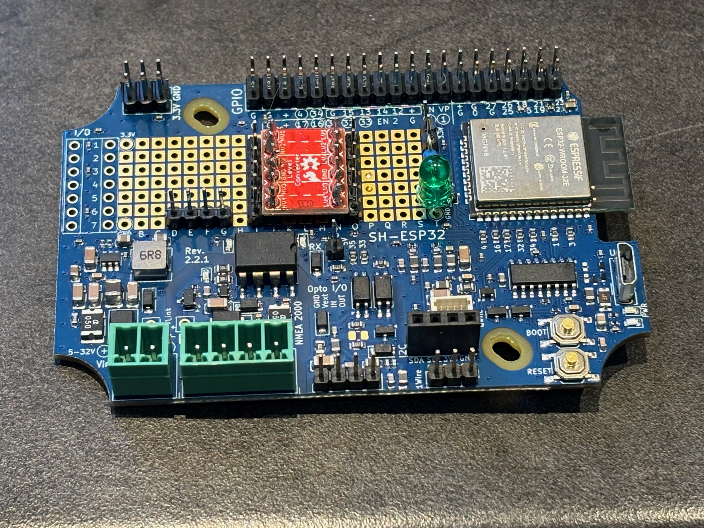  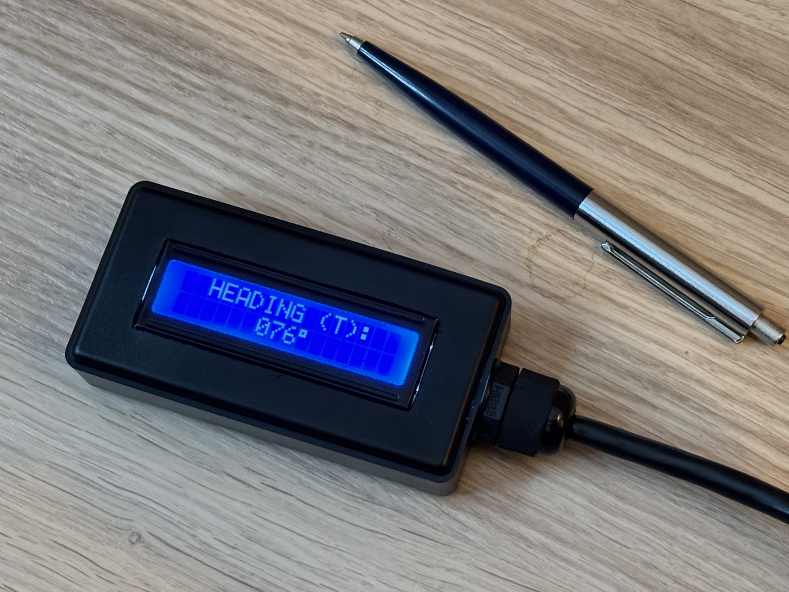  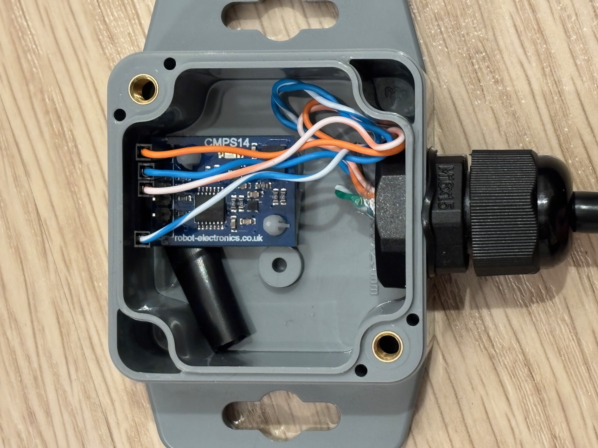           


